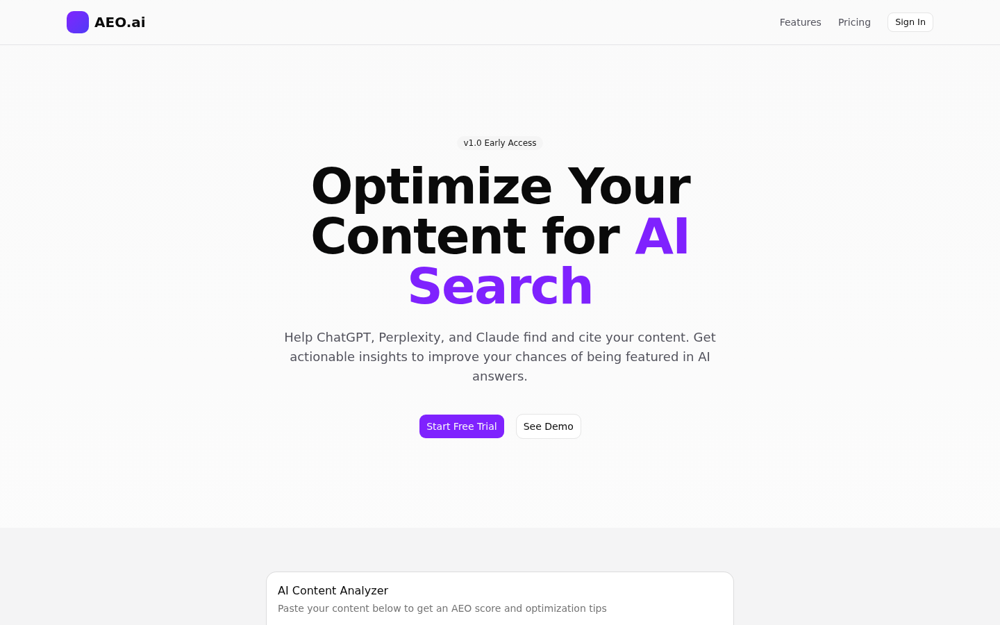
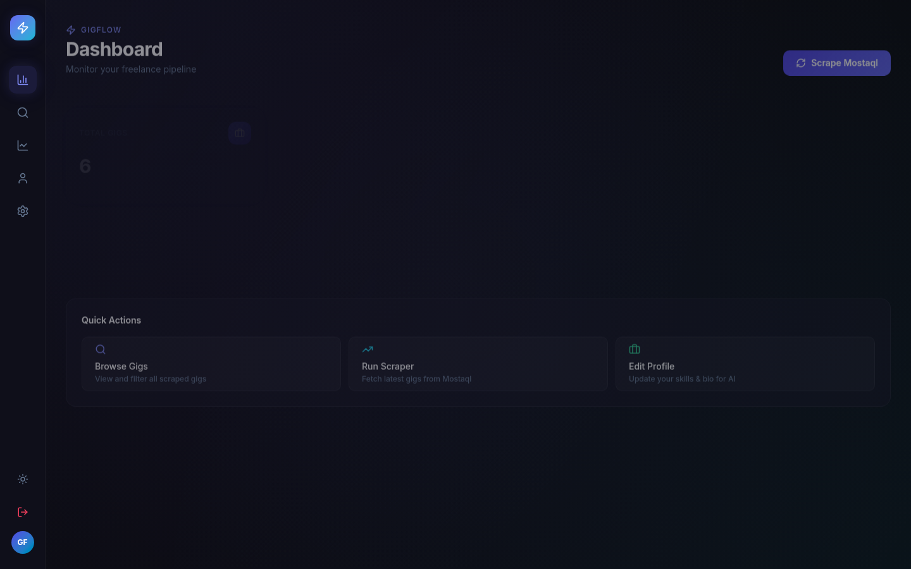
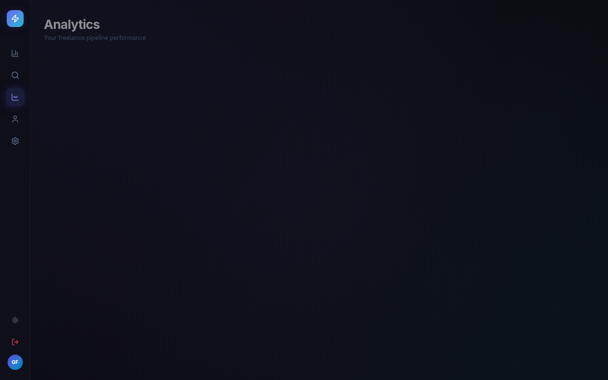

<!-- Animated typing header -->

<!-- Status badges -->

  
  
  

<!-- GitHub streak -->

  

<!-- GitHub activity graph -->

---

<!-- Quick intro -->

  <em>
    I turn ideas into shipped products — from scoping requirements to building the backend,
    wiring up auth &amp; payments, and deploying to production.
    Most of my work pairs <strong>Next.js + Supabase + the Vercel AI SDK</strong>.
  </em>

  
    Profile page is a work in progress while I finish my internship —
    the featured projects below are real &amp; deployed.
  

  

---

## ⚡ Featured Projects

### 📈 AEO.ai

  <em>
    An "Answer Engine Optimization" SaaS that scores content
    for AI-search citation readiness.
  </em>

  
  
  
  

  Freemium limits · subscription tiers · AI analysis API ·
  Supabase migrations + RLS · deployed on Vercel

  

  <a href="https://github.com/SoYama350/aeo-ai">
    📂 Code
  </a>
  &nbsp; · &nbsp;
  <a href="https://my-business-opencode.vercel.app">
    🚀 Live Demo
  </a>

---

### ⚡ GigFlow

  <em>
    Freelance gig automation: scrapes remote gigs, auto-applies,
    and tracks apply-rate per source.
  </em>

  
  
  

  Scraper pipeline · auto-apply · analytics per source · real data

  
  

  <a href="https://github.com/SoYama350/Gig-flow">
    📂 Code
  </a>
  &nbsp; · &nbsp;
  <a href="https://soyama350.github.io/Gig-flow/">
    🚀 Live App
  </a>

---

### 👶 Parenting Mentor

  <em>
    An AI-assisted app that helps new parents raise kids
    and break bad habits.
  </em>

  
  
  

  Built with Google AI Studio · AI-assisted recommendations ·
  no live demo yet

  <a href="https://github.com/SoYama350/parenting-mentor-app">
    📂 Code
  </a>

---

## 🛠️ Tech Stack

  

  

  

<b>📋 Detailed stack</b>

| Area            | Tools                                                            |
| --------------- | ---------------------------------------------------------------- |
| Frontend        | React, Next.js (App Router), TypeScript, Tailwind CSS, Shadcn UI |
| Backend         | Node.js, Next.js API Routes, Supabase (Postgres), Vercel AI SDK  |
| Auth & Payments | NextAuth, Supabase GoTrue, Lemon Squeezy                         |
| AI              | OpenAI / OpenRouter, structured output (Zod)                     |
| DevOps          | Vercel, GitHub Actions                                           |
| Testing         | Vitest, Testing Library                                          |

  

---

## 📬 Connect

  

 

 

  

---

  
    Profile README — work in progress. Built by Mohamed Khaled.
  

